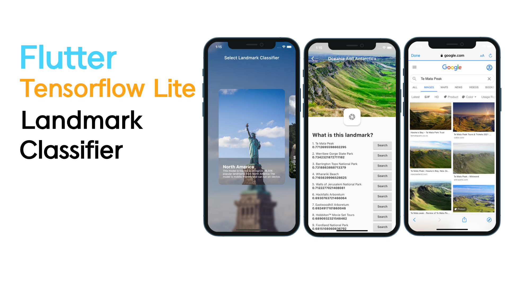

# Flutter TFLite Landmark Classifier
This is a project that can recognize and search landmarks in each region.
(Asia, South America, North America, Europe, Oceania, Antarctica)

It includes how to apply the model and how to process label data.

Unfortunately, the performance of the tflite model results worse than the example of tfhub. 
To be used in real-world projects, you need to improve the performance of your model.

 

## Youtube
[Flutter Landmark Classifier (TFLite) - SpeedCode](https://youtu.be/kxh9BHfkD2A)

 

## Label Data Edit Page
- https://onlinecsvtools.com/delete-csv-columns

## TFLite Package Initial setup
To use the tflite model, follow the guide on the page below.    
- https://pub.dev/packages/tflite_flutter#important-initial-setup

## TFHub Landmark Models
- https://tfhub.dev/google/on_device_vision/classifier/landmarks_classifier_asia_V1/1
- https://tfhub.dev/google/on_device_vision/classifier/landmarks_classifier_south_america_V1/1
- https://tfhub.dev/google/on_device_vision/classifier/landmarks_classifier_oceania_antarctica_V1/1
- https://tfhub.dev/google/on_device_vision/classifier/landmarks_classifier_north_america_V1/1
- https://tfhub.dev/google/on_device_vision/classifier/landmarks_classifier_europe_V1/1

## Packages
* multi_image_picker : https://pub.dev/packages/multi_image_picker

* image : https://pub.dev/packages/image

* tflite_flutter : https://pub.dev/packages/tflite_flutter

* tflite_flutter_helper : https://pub.dev/packages/tflite_flutter_helper

* url_launcher : https://pub.dev/packages/url_launcher

## Keyword
Classification, Landmark, Flask, Heroku, Flutter, Tensorflow
